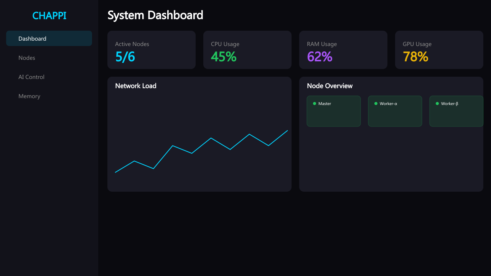

# 🤖 Chappi - Distributed AI Control System

A Progressive Web App (PWA) for monitoring and controlling distributed AI networks. Built with Next.js 16, featuring real-time WebSocket communication, hardware monitoring, and AI chat interface.



## ✨ Features

### 📊 Dashboard
- Real-time system metrics (CPU, RAM, GPU)
- Network load visualization
- Node status overview
- Health score calculation

### 🖥️ Node Management
- Individual node monitoring
- Hardware profile details
- Power controls (On/Off/Restart)
- Process monitoring
- Command execution

### 🔗 Node Linking
- **QR Code** - Scan to link new PCs
- **Manual Code** - 8-character codes
- Hardware profile collection
- Real-time status updates

### 🧠 AI Control
- Chat with Chappi AI
- Training task management
- Parameter configuration
- Progress visualization

### 💾 Memory System
- Conversation history
- Cloud backup
- Search functionality

### 📱 PWA Features
- Installable on Android/iOS/Desktop
- Offline support
- Push notifications
- Background sync

## 🚀 Quick Start

```bash
# Clone the repository
git clone https://github.com/your-username/chappi.git
cd chappi

# Install dependencies
bun install

# Generate Prisma client
bun run db:generate

# Start development server
bun run dev

# Start WebSocket service (separate terminal)
cd mini-services/chappi-ws && bun run dev
```

Open [http://localhost:3000](http://localhost:3000) and use the API key: `chappi-admin-key`

## 🏗️ Architecture

```
┌─────────────────────────────────────────────────────────┐
│                    CHAPPI PWA                            │
│  ┌─────────┐ ┌─────────┐ ┌──────────┐ ┌────────────┐   │
│  │Dashboard│ │ Nodes   │ │AI Control│ │   Memory   │   │
│  └────┬────┘ └────┬────┘ └────┬─────┘ └─────┬──────┘   │
│       │          │           │              │           │
│       └──────────┴───────────┴──────────────┘           │
│                         │                                │
│                    WebSocket                            │
│                         │                                │
└─────────────────────────┼───────────────────────────────┘
                          │
              ┌───────────┴───────────┐
              │   WebSocket Server     │
              │     (Port 3003)        │
              │                       │
              │  • Node Management    │
              │  • Linking Codes      │
              │  • Training Tasks     │
              │  • Real-time Events   │
              └───────────────────────┘
                          │
        ┌─────────────────┼─────────────────┐
        │                 │                 │
   ┌────┴────┐      ┌────┴────┐      ┌────┴────┐
   │ Node 1  │      │ Node 2  │      │ Node N  │
   │ (Agent) │      │ (Agent) │      │ (Agent) │
   └─────────┘      └─────────┘      └─────────┘
```

## 📁 Project Structure

```
chappi/
├── src/
│   ├── app/
│   │   ├── api/              # API Routes
│   │   │   ├── auth/         # Authentication
│   │   │   ├── linking/      # Node linking
│   │   │   ├── nodes/        # Node management
│   │   │   ├── conversations/# Chat history
│   │   │   └── backups/      # Memory backups
│   │   ├── layout.tsx        # Root layout
│   │   └── page.tsx          # Main app
│   ├── components/
│   │   ├── ui/               # shadcn/ui components
│   │   ├── dashboard.tsx     # Dashboard view
│   │   ├── nodes-view.tsx    # Nodes management
│   │   ├── ai-control.tsx    # AI chat & training
│   │   ├── memory-view.tsx   # Conversation memory
│   │   ├── sidebar.tsx       # Navigation
│   │   ├── linking-modal.tsx # QR/Code linking
│   │   └── node-hardware-profile.tsx
│   ├── hooks/
│   │   └── use-websocket.ts  # WebSocket hook
│   └── lib/
│       ├── store.ts          # Zustand state
│       └── db.ts             # Prisma client
├── mini-services/
│   └── chappi-ws/            # WebSocket server
│       └── index.ts
├── public/
│   ├── icons/                # PWA icons
│   ├── screenshots/          # PWA screenshots
│   ├── manifest.json         # PWA manifest
│   └── sw.js                 # Service worker
├── scripts/
│   ├── generate-icons.js     # Icon generator
│   ├── generate-screenshots.js
│   └── chappi_agent.py       # PC agent simulator
├── prisma/
│   └── schema.prisma         # Database schema
├── .github/
│   └── workflows/
│       └── deploy.yml        # CI/CD pipeline
├── vercel.json               # Vercel config
└── next.config.ts            # Next.js config
```

## 🔧 Environment Variables

Create `.env.local` file:

```env
# Database
DATABASE_URL="file:./db/chappi.db"

# Authentication
NEXTAUTH_URL=http://localhost:3000
NEXTAUTH_SECRET=your-secret-key

# WebSocket
NEXT_PUBLIC_WS_URL=ws://localhost:3003
NEXT_PUBLIC_WS_PORT=3003

# API
CHAPPI_API_KEY=chappi-admin-key
```

## 🚀 Deploy to Vercel

### 1. Push to GitHub

```bash
git init
git add .
git commit -m "Initial commit"
git branch -M main
git remote add origin https://github.com/your-username/chappi.git
git push -u origin main
```

### 2. Configure Vercel

1. Go to [vercel.com](https://vercel.com)
2. Import your GitHub repository
3. Configure environment variables:
   - `DATABASE_URL` - SQLite or PostgreSQL connection
   - `NEXTAUTH_SECRET` - Random secret for auth
   - `NEXTAUTH_URL` - Your Vercel URL
   - `CHAPPI_API_KEY` - Admin API key

### 3. Configure Secrets for CI/CD

Add these secrets in GitHub repository settings:

- `VERCEL_ORG_ID` - From Vercel account settings
- `VERCEL_PROJECT_ID` - From project settings
- `VERCEL_TOKEN` - Generate from Vercel settings

### 4. Deploy

Push to main branch - GitHub Actions will automatically deploy!

## 📱 Install as PWA

### Android
1. Open Chrome
2. Navigate to your deployed URL
3. Tap "Add to Home Screen"

### iOS
1. Open Safari
2. Navigate to your deployed URL
3. Tap Share → "Add to Home Screen"

### Desktop
1. Open Chrome/Edge
2. Navigate to your deployed URL
3. Click install icon in address bar

## 🔗 Node Agent (PC Software)

The PC agent collects hardware data and sends it to the server.

### Windows (Python)

```python
# Install dependencies
pip install requests wmi psutil

# Run with linking code
python chappi_agent.py --server https://your-app.vercel.app --code ABCD1234
```

### Hardware Profile Collected
- **CPU**: Model, cores, threads, frequency, usage
- **RAM**: Total, used, free, available
- **GPU**: Model, VRAM, driver, usage
- **Disks**: Capacity, type (SSD/HDD), usage
- **System**: Hostname, IP, MAC, OS, uptime
- **Access**: User, admin status, privileges

## 🛠️ Tech Stack

- **Framework**: Next.js 16 (App Router)
- **Language**: TypeScript 5
- **Styling**: Tailwind CSS 4 + shadcn/ui
- **State**: Zustand
- **Charts**: Recharts
- **Real-time**: Socket.IO
- **Database**: SQLite + Prisma
- **PWA**: Service Worker + Web App Manifest

## 📄 License

MIT License - feel free to use this for your own projects!

---

Built with ❤️ for distributed AI systems
